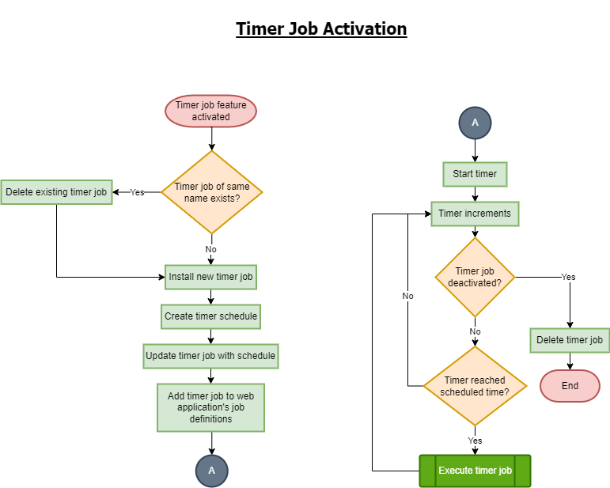
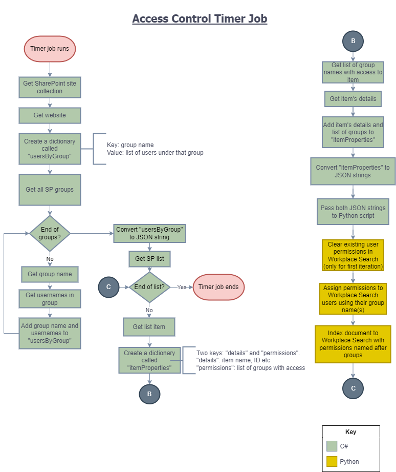
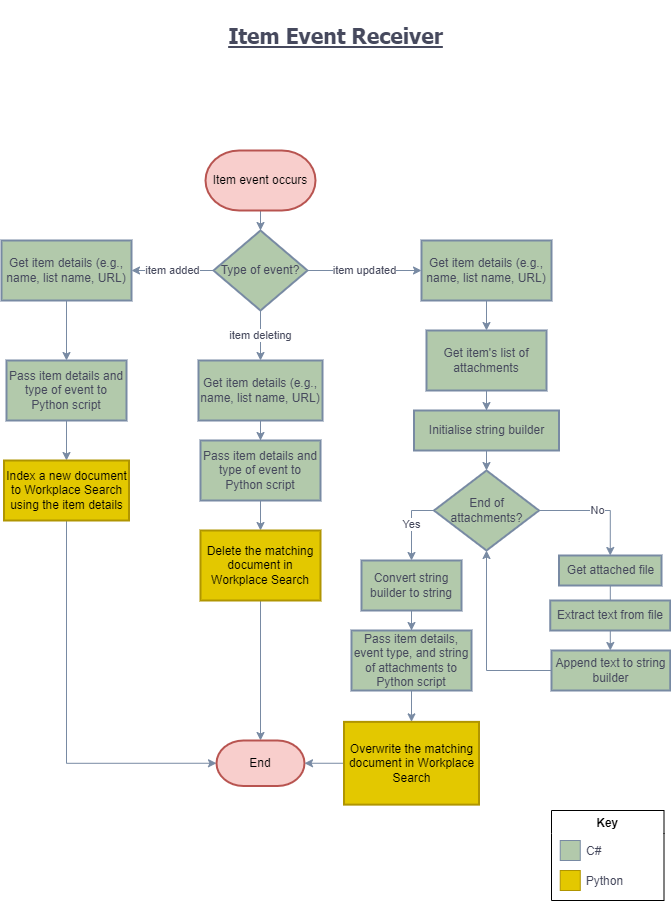
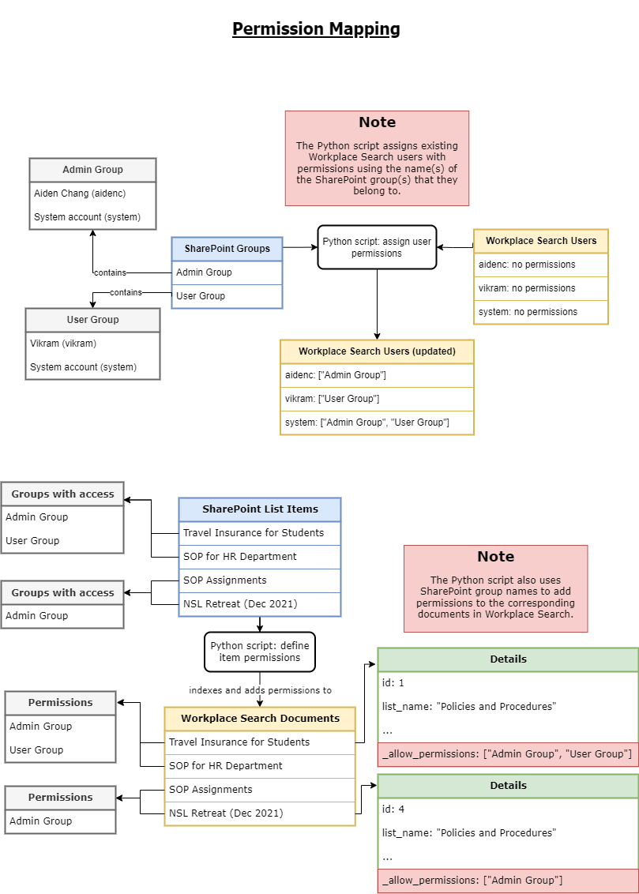

# SP-Elastic
SharePoint 2013 is not available as a [first-party content source](https://www.elastic.co/guide/en/workplace-search/current/workplace-search-content-sources.html#oauth-first-party-content-sources) in Elastic Workplace Search. This project was created to extract items from SharePoint lists and index them as documents to Workplace Search via [document APIs](https://www.elastic.co/guide/en/enterprise-search-clients/python/7.16/_workplace_search_apis.html#workplace-search-document-apis). This process is automated using an event receiver built using Visual Studio.

Access control in SharePoint can also be ported over to Workplace Search using the [permission API](https://www.elastic.co/guide/en/enterprise-search-clients/python/7.16/_workplace_search_apis.html#workplace-search-permissions-apis). A timer job was also created to schedule and trigger this action.

## Visual Studio Packages
The following packages were installed and used in the project.
* [IKVM](https://www.nuget.org/packages/IKVM/)
* [Newtonsoft.Json](http://www.newtonsoft.com/json)
* [TikaOnDotnet](http://www.github.com/KevM/tikaondotnet)
* [TikaOnDotnet.TextExtractor](http://www.github.com/KevM/tikaondotnet)

## Primary Files
The following files contain the essential code for the item event receiver and access control timer job functions.
| File name | Function |
| --- | --- |
| [TimerJob.cs](../CYL_Project/TimerJob.cs) | Extracts item details and SharePoint group details. |
| [Feature2.EventReceiver.cs](../CYL_Project/Features/Feature2/Feature2.EventReceiver.cs) | Handles activation and deactivation of the timer job. |
| [EventReceiver1.cs](../CYL_Project/EventReceiver1/EventReceiver1.cs) | Extracts event type and item details. |
| [access_control_sync.py](../Python/access_control_sync.py) | Assigns permissions to Workplace Search users and documents, as well as clearing permissions from users. |
| [event_receiver.py](../Python/event_receiver.py) | Indexes or deletes corresponding Workplace Search documents. |

## Important Reminders
* Change the relevant file paths used in the C# codes e.g., path to Python installation, path to Python scripts, paths for log files
* To change the targeted list of the item event receiver, change the `ListUrl` attribute of the `Receivers` tag in [Elements.xml](../CYL_Project/EventReceiver1/Elements.xml)

## Workflow Diagrams

  
All diagrams above were created using [diagrams.net](https://app.diagrams.net/).

## Notes
- If the Visual Studio solution fails to deploy with an error message like "operation is not valid due to the current state of the object", a simple fix is to right-click on the project file and retract it, unload the project, and reload it.
- The timer job was created with guidance from a [tutorial page](https://www.codesharepoint.com/sharepoint-tutorial/how-to-create-sharepoint-timer-job-programmatically).

## About
This project was done as part of an internship programme at [CSIT](https://www.csit.gov.sg/).
